# trboard

基于贡献度和离群度的工具实现

# 环境配置

* 系统：win10

- 前端：node 22.13.1，npx 11.0.0

- 后端：go 1.23.1
- 数据库：postgre 17.2

前端目前使用的next.js 框架，通过`npx create-next-app@latest`开始项目，后端目前采用的gin框架。

前端页面可以单独运行，账号admin 密码 123

# 前端

```bash
cd frontend
npm install
npm run dev 
```

# 后端

```bash
cd backend
go mod tidy
go run main.go
```

# 目前完成的功能

* 一个简单的登陆页面

  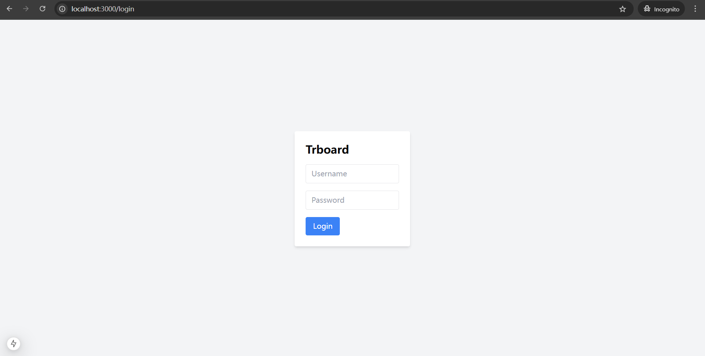

* dashboard页面

  

* 上传脚本

  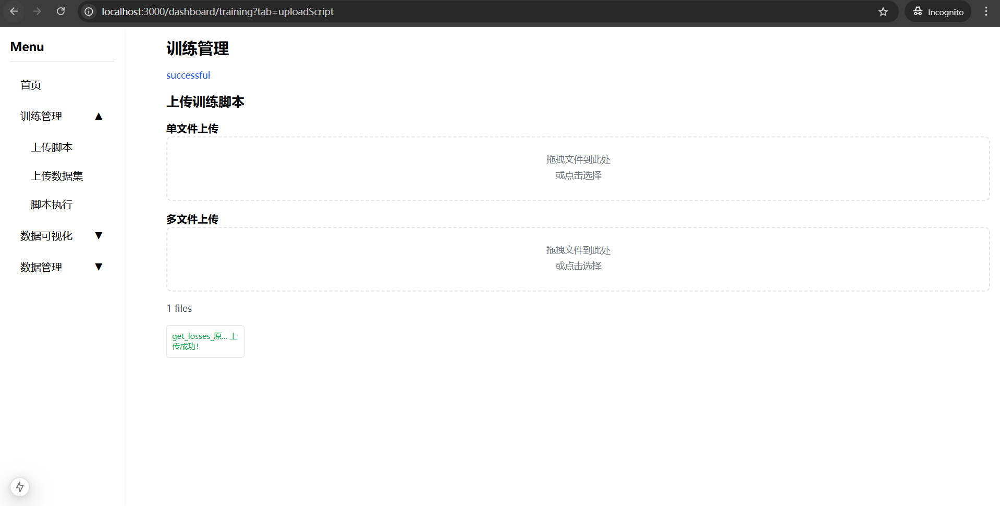

* 上传数据

  

* 脚本执行
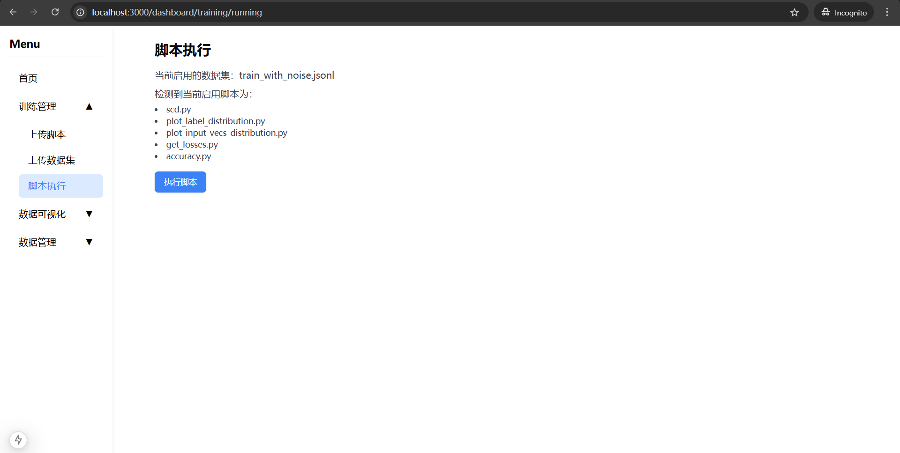
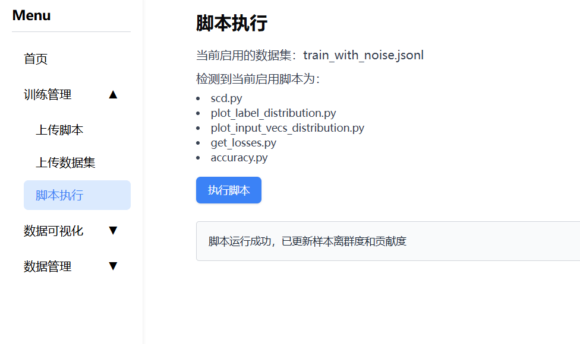
* 上传管理
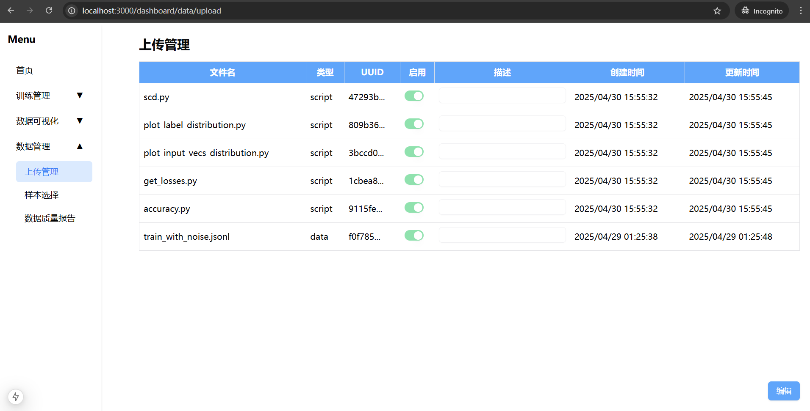


 * 样本选择
 
 * 数据分布可视化
  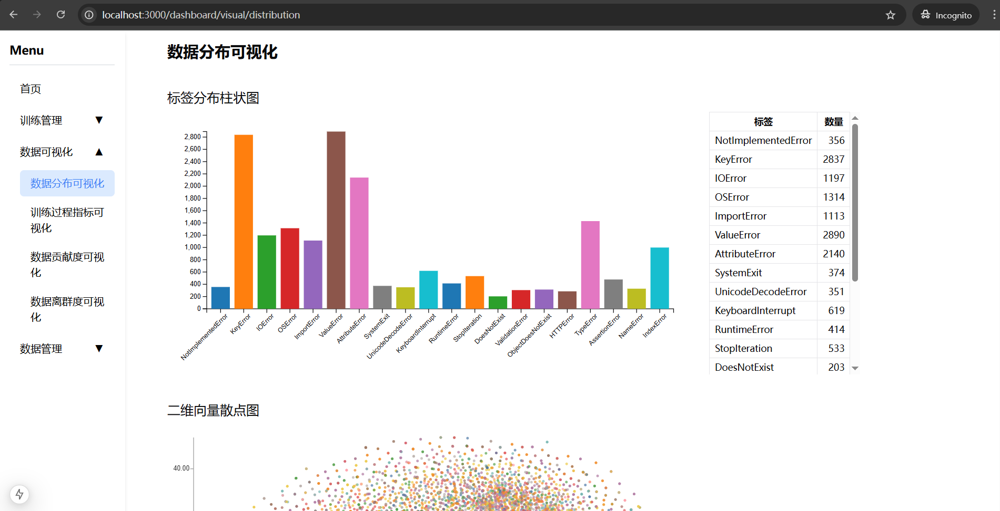
* 训练过程指标可视化
  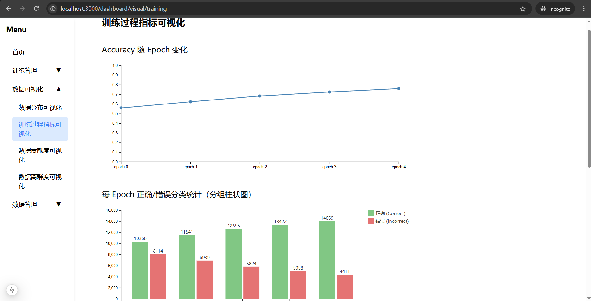
  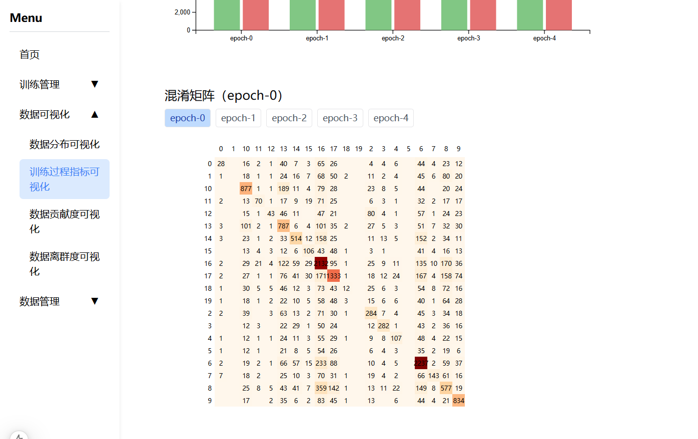
* 贡献度
  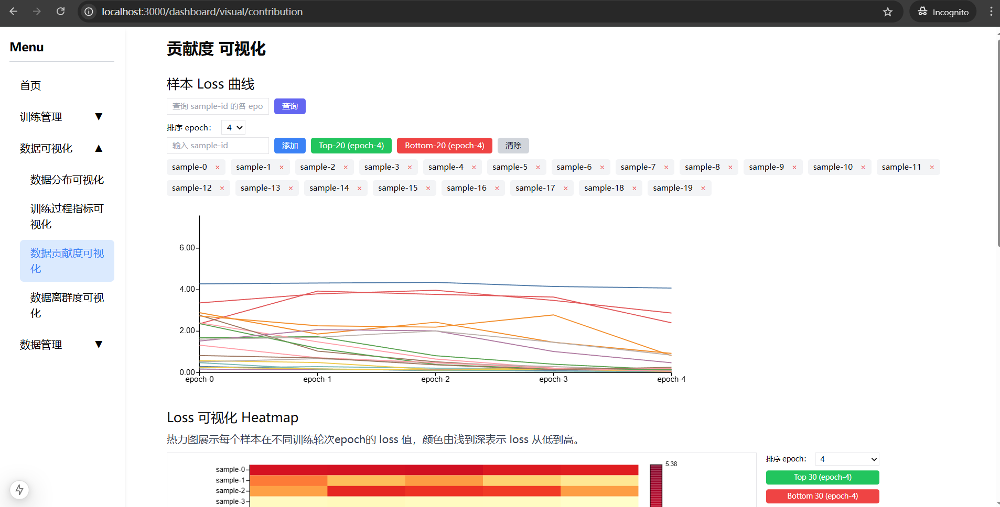
  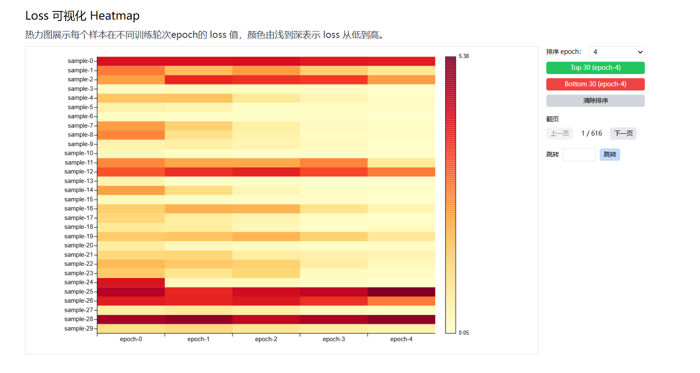
  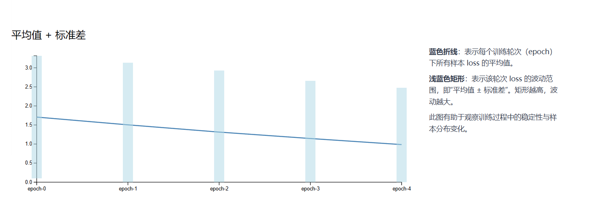
* 离群度
  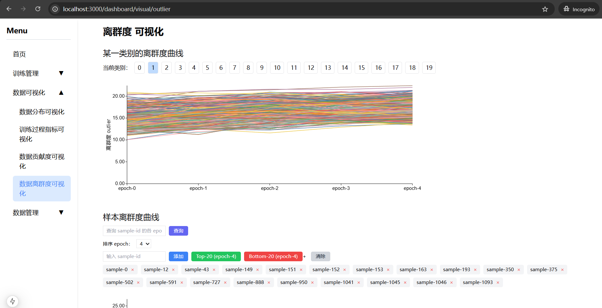
  
  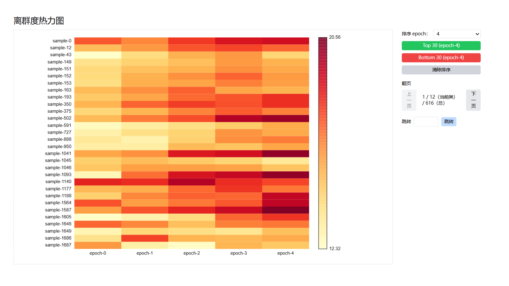

# 可能存在的问题

浏览器error显示:

> **Hydration** **failed** **because** **the** **server** **rendered** **HTML** **didn't** **match** **the** **client.** **As** **a** **result** **this** **tree** **will** **be** **regenerated** **on** **the** **client.** **This** **can** **happen** **if** **a** **SSR-ed** **Client** **Component** **used**

提到服务端渲染和客户端不一致的问题，还不太清楚原因。
可能是浏览器插件注入一些元素的影响，目前换个浏览器/无痕模式/移除某些扩展插件解决。